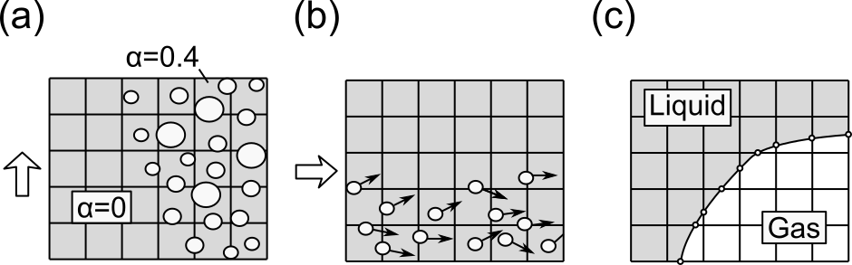

# 最近の2相流計算に関する動向調査

船舶海洋工学分野における2相流計算に関して文献ベースで調査を行った．

## 文献リスト

**Table 1 Journal review of two-phase flow calculatin in ship hydrodynamics.**

| Author | Year | Ship/Geometry | Interface capturing | Bubble model | Solver | Note |
| ---- | ---- | ---- | ---- | ---- | ---- | ---- |
| Mohanarangam[^1] | 2009 | Plate | Euler-Euler | MUSIG | ANSYS CFX 11 |  |
| Wu[^2] | 2020 | Bulk carrier | VOF | - | Ster CCM+ | Propeller |
| Kim[^3] | 2021 | Channel | VOF | - | OpenFOAM | DNS |
| Xia[^4] | 2023 | Underwater vehicle | Euler-Euler | PBM | Fluent? |  |
| Shao[^5] | 2024 | Underwater vehicle | Euler-Euler | Constant diamter | Fluent |  |
| Mohammadpour[^6] | 2024 | Catamaran ferry | VOF | - | Star CCM+ | GILLS | 
| Zhao [^7] | 2025 | KVLCC2 | Euler-Euler | IATE | OpenFOAM |  |

* MUSIG: Multiple-size group, PBMと同じ
* PBM: Population Balance Model, MUSIGと同じ
* GILLS: gas-injected liquid lubrication system, Kumagai et al.のデバイス
* IATE: Interfacial Area Transport Equation

# 気液界面の表現方法

**Fig. 1 Method of interface capturing**

* Volume of Fluid (VOF)法はメッシュ解像度が十分であれば一番精度が良く，気液間相互作用を支配方程式に入れなくて済む．ただし，メッシュ解像度が低いと計算結果が不自然な分散状態となる．
* Euler-Euler法は連続相(水)と分散相(空気)のそれぞれに対して支配方程式を解く．気液間相互作用項のモデル化に任意性がある．気泡の分裂・合体を考慮したPopulation Balance Model(PBM)は是非導入すべきだが，元々のモデルは一様な乱流拡散状態で開発されたものなので，下流方向に発達する乱流境界層に対して適切であるかどうかは検証すべきである．
* OpenFOAMの標準機能ではPBMを利用できないが，独自にコードをカスタマイズして導入した事例は報告されている．PBMほど高度でないInterfacial Area Transport Equation (IATE)モデルは現行のOpenFOAMで利用できる．Fluent, ANSY CFXでは標準機能でPBMを利用できる．

# メッシュ解像度と解析精度の関係

* 単相流や砕破を伴わない船の自由表面流れについては，RANSによるメッシュ依存性検証の手法は確立されている．
* 自由表面が精度良く再現されていることと粘性流れがきちんと解けていることは別である．
* Euler-Euler法を用いたとき，計算格子を細かくしても混相状態の計算精度が向上するとは限らない．特に，壁近傍の混相状態を適切に表現するモデルは少ないので注意が必要である．

# References
[^1]: Mohanarangam, K., Cheung, S. C. P., Tu, J. Y., & Chen, L. (2009). Numerical simulation of micro-bubble drag reduction using population balance model. Ocean Engineering, 36(11), 863-872.
[^2]: Wu, H., Ou, Y., & Ye, Q. (2020). Numerical study on the influence of air layer for propeller performance of large ships. Ocean Engineering, 195, 106681.
[^3]] Kim, S., Oshima, N., Park, H. J., & Murai, Y. (2021). Direct numerical simulation of frictional drag modulation in horizontal channel flow subjected to single large-sized bubble injection. International Journal of Multiphase Flow, 145, 103838.
[^4]: Xia, W., Song, W., Wang, C., Yi, W., Meng, Q., & Deng, H. (2023). Microbubbles drag reduction characteristics of underwater vehicle during pitching movement. Ocean Engineering, 285, 115350.
[^5]: Shao, X., Liang, N., Qin, S., Cao, L., & Wu, D. (2024). Numerical investigation of microbubble drag reduction on an axisymmetric body based on Eulerian multiphase model. Ocean Engineering, 298, 117157.
[^6] Mohammadpour, J., Salehi, F., Garaniya, V., Baalisampang, T., Arzaghi, E., Roberts, R., ... & Abbassi, R. (2024). Computational analysis of air bubble-induced frictional drag reduction on ship hulls. Journal of Marine Science and Technology, 29(3), 696-710.
[^7]: Zhao, X., Hao, Y., Cui, J., & Jiang, Y. (2025). Numerical investigations on drag reduction by micro-bubbles of KVLCC2 ship model by means of OpenFOAM. Ocean Engineering, 341, 122609.